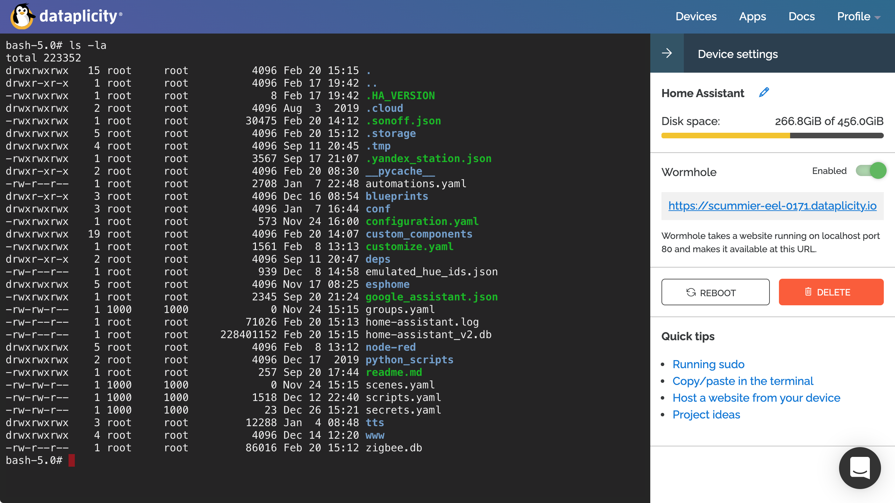

# Dataplicity for Home Assistant

Custom component for public HTTPS access to [Home Assistant](https://www.home-assistant.io/) with [Dataplicity](https://www.dataplicity.com/) service.

Should work on any Linux PC or ARM, not only Raspberry as Dataplicity service said. Don't work on Windows.

With free Dataplicity subscription - limited to only one server.

**ATTENTION:** Dataplicity **will be able to access all information that flows through their servers** if they want to. Use at your own risk. Read more: [github][1], [hass community][2], [raspberry forum][3]

[1]: https://github.com/hacs/default/pull/940#issuecomment-840687472
[2]: https://community.home-assistant.io/t/hass-io-add-on-webhook-relay-webhook-forwarding-remote-access/70961/2
[3]: https://www.raspberrypi.org/forums/viewtopic.php?f=63&t=117100

If you have an extra $5 per month - it's better to use [Nabu Casa](https://www.nabucasa.com/about/) service for public HTTPS access to Home Assistant. In this way you can support the core developers of Home Assistant. Also they uses TLS pass-through, so your data will be secure.

## Installation

**Method 1.** [HACS](https://hacs.xyz/) custom repo:

> HACS > Integrations > 3 dots (upper top corner) > Custom repositories > URL: `AlexxIT/Dataplicity`, Category: Integration > Add > wait > Dataplicity > Install

**Method 2.** Manually copy `dataplicity` folder from [latest release](https://github.com/AlexxIT/Dataplicity/releases/latest) to `/config/custom_components` folder.

## Configuration

> Configuration > Integrations > Add Integration > **Dataplicity**

If the integration is not in the list, you need to clear the browser cache.
